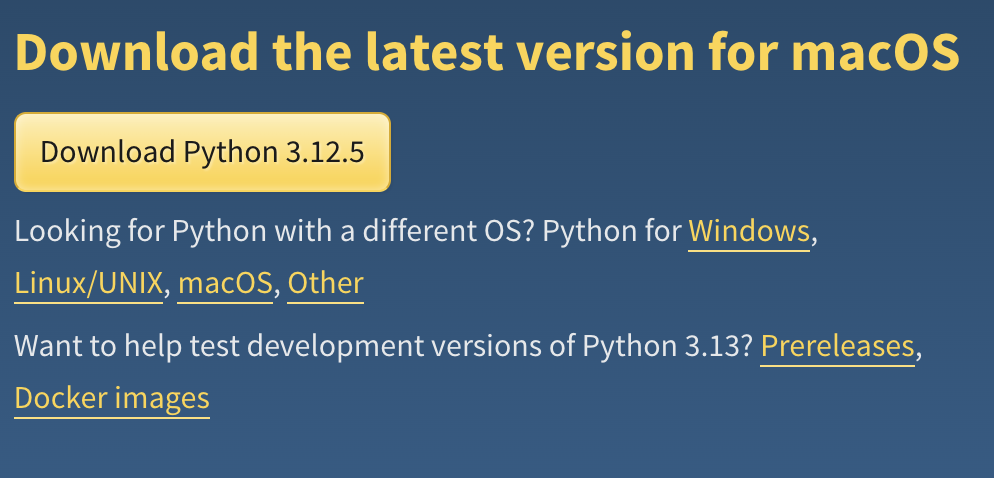
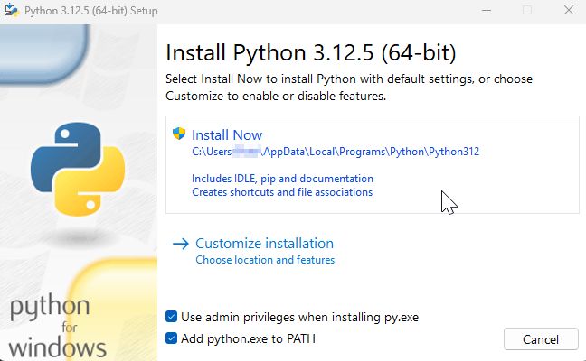
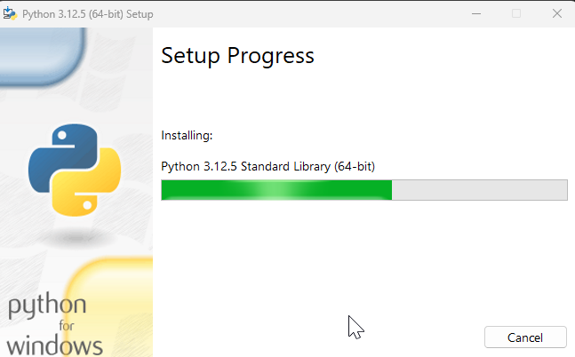
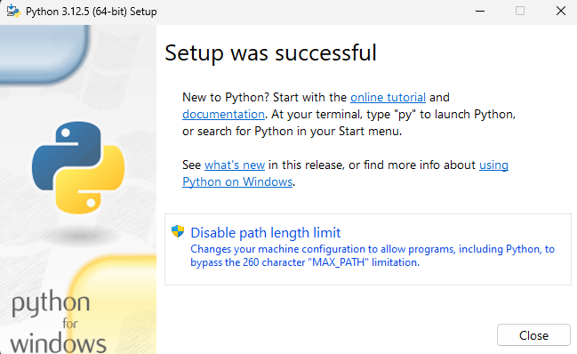
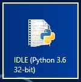
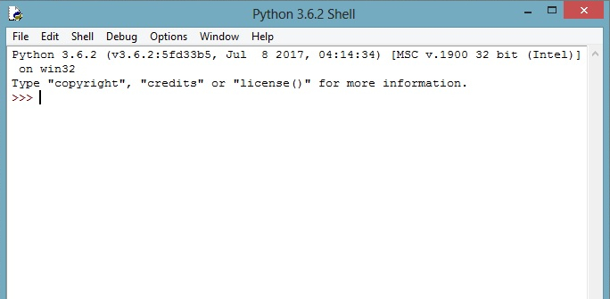
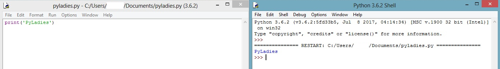

# Dodatek 1. Instalacja Pythona

Praca na stronie repl.it jest wygodna podczas nauki, jednak aby w pełni
korzystać z Pythona, warto go zainstalować na własnym komputerze.  Poniżej
znajdziesz instrukcję instalacji Pythona na systemie Windows.  Jeżeli
używasz innego systemu operacyjnego - poproś o pomoc mentora.

## Krok 1: pobierz program instalacyjny

Wejdź na stronę [https://www.python.org/downloads/](https://www.python.org/downloads/)
i odszukaj w niej przycisk "Download Python 3.12.5"
(liczby na przycisku oznaczają wersję Pythona i mogą wskazywać również wyższą wersję).
Kliknij w niego. W ten sposób pobierzesz program instalacyjny Pythona.

## Krok 2: uruchom program instalacyjny

Odszukaj na dysku program instalacyjny i uruchom go.  Zobaczysz okno
zatytułowane "Install Python 3.12.5".  Upewnij się, że opcja "Add python.exe to PATH"
jest zaznaczona, a następnie kliknij przycisk "Install Now".

> Jeśli będziesz mieć problem z instalacją Python z użyciem praw administratora - odznacz
> opcję "Use admin privileges when installing py.exe" i spróbuj ponownie.

## Krok 3: czekaj aż instalacja dobiegnie końca

Instalacja Pythona może potrwać nawet kilkanaście minut.

## Krok 4: upewnij się, że instalacja przebiegła prawidłowo

Jeżeli instalacja powiedzie się, w oknie programu instalacyjnego pojawi
się napis "Setup was successful".  Gdyby tak się nie stało, poproś o pomoc
mentora.

## Krok 5: uruchom program IDLE

Wraz z Pythonem został zainstalowany program IDLE, w którym możesz edytować
pliki z kodem.  Jest tam też dostępny tryb interaktywny.  IDLE to kompletne
środowisko programistyczne, w którym możesz tworzyć nawet zaawansowane
programy.

Odszukaj IDLE wśród programów zainstalowanych na Twoim komputerze i uruchom
go.

## Krok 6: tryb interaktywny

Po pierwszym uruchomieniu domyślnie otworzy się tryb interaktywny.
Spróbuj wpisać kilka znanych Ci poleceń.

## Krok 7: napisz i uruchom swój pierwszy program

Kliknij opcję "File" w pasku u góry okna, a następnie wybierz "New File".
Pojawi się okno edytora.  Wpisz w nim kod jakiegoś programu, np.
`print('PyLadies')`.  Zapisz plik wybierając "File", a następnie "Save".
Aby uruchomić program kliknij w "Run" i "Run Module" (albo wciśnij klawisz
F5).  Program zostanie uruchomiony.  Jeżeli wypisze jakiś tekst na ekran,
to zobaczysz go w oknie trybu interaktywnego.

To wszystko.  Masz już na swoim komputerze środowisko do programowania
w Pythonie.  Możesz pisać kod programów, zapisywać go w plikach, otwierać
je i uruchamiać.  Możesz również pracować w trybie interaktywnym.

