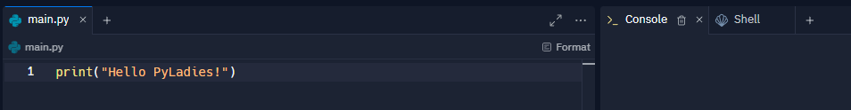

# Chapter 1. Interactive mode

We will start the workshop by explaining how we will be programming in Python.

## Let's begin!

### Handling interactive mode on replit.com

If you have a Python interpreter installed locally, you can skip this section.

If you don't have a Python interpreter installed locally, open
[this link](https://replit.com/languages/python3) in a separate browser tab.

If you don't have an account on `replit.com`, you'll need to create one.

Go to [this guide to create an account](d06_replit.md).

The page you're looking at is divided into two parts:

* On the left side, with a white background, is the **text editor**,
* On the right side, you can see the console (**Console**) and the shell (**Shell**).

  

The editor allows you to create the entire program code and then run it by
pressing the "Run" button (or using the Ctrl + Enter keyboard shortcut).
If the program prints any text, we'll see it in the console.

You can activate interactive mode by going to the **Shell** tab and running
the `python` command. You will then see the prompt `>>>`, which indicates that
you can enter Python commands.

### Interactive mode on your own computer

You can activate interactive mode by running the `python` command in the terminal.
You will then see the prompt `>>>`, which indicates that
you can enter Python commands.

## Interactive mode - how does it work?

When you enter a command and press Enter, the interactive mode executes it and
displays its result. This way, you can program and immediately see the results.

Working with the interactive mode is convenient when you want to test the
functionality of a single operation or when you are unsure which operations
you want to perform. If you already know what program you want to write, then
it is easier to use an editor.

There is one more important difference between interactive mode and an editor:
interactive mode always prints the result of an operation after it is executed.
The editor will only do so if we give it such a command (using the `print`
statement, which we will discuss later).

For now, we will be using the **interactive mode** as we will be learning
individual instructions and observing their results. Do not be afraid to
experiment with different variations of these commands. In the worst case scenario,
Python will inform you that the entered code cannot be executed.

## Prompt sign

In the code examples that you will find in the following chapters, you will
often see the character string `>>>`. This is the **prompt character**.
We use it to distinguish text that should be entered in interactive mode
from text that the Python interpreter prints out itself. If you see a prompt
character in a line of an example, it means that everything that follows the
character - until the end of the line - should be entered in interactive mode,
and then the Enter key should be pressed. We do not enter the prompt character itself!

## :pushpin: Summary

In this chapter:

We opened the `repl.it` website, where we can program in either the **editor** or
**interactive mode** of Python. We learned what the **prompt character** looks like
and that it shows us the code to enter in interactive mode.

The next step is to analyze the data and identify patterns or trends. This will
help us better understand the information and draw meaningful conclusions.

Once the data has been analyzed and patterns and trends have been identified, we
can gain a deeper understanding of the information and draw significant conclusions.

:checkered_flag: Next chapter: [Text](./02_text.md)
:checkered_flag:
