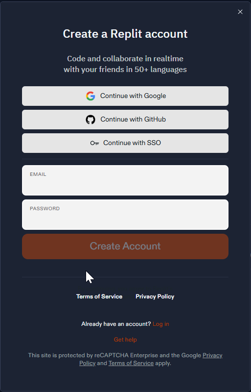
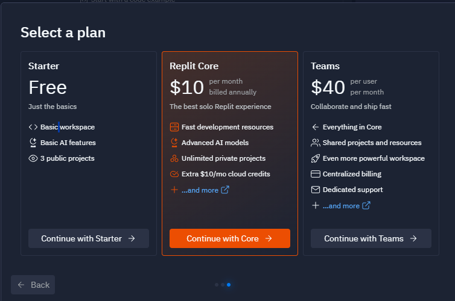
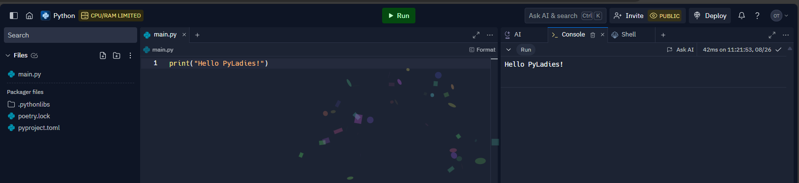

# Appendix 6. Creating an Account and Using replit.com

This appendix provides information on how to use the `replit.com` platform.

## 1. Creating an Account

Go to the account creation page on [replit.com](https://replit.com/languages/python3?authModal=language-page%3Ahero).



After creating your account, log in.

## 2. Choosing a Plan

Select the "Starter" plan by clicking the "Continue with Starter" button.


## 3. Testing the Platform

In the open "main.py" file, enter the following code:

```python
print("Hello, PyLadies!")
```

Then click the "Run" button at the top of the screen.



You will see the output in the window on the right side.
